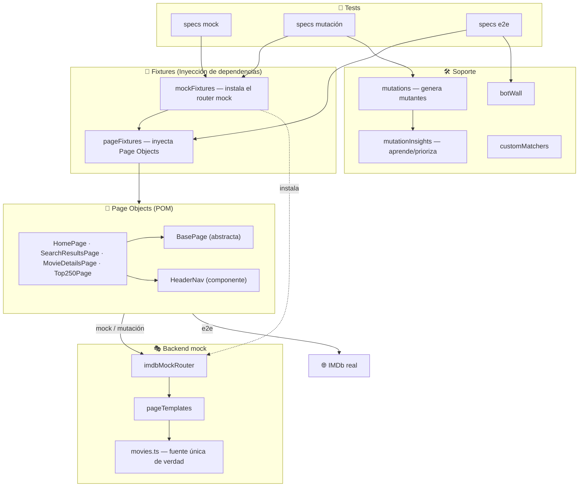
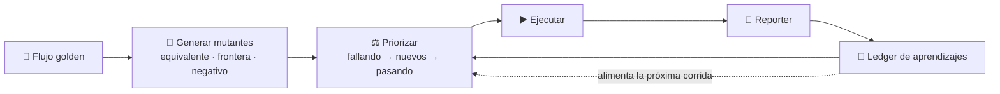
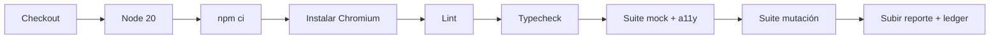

<p align="right"><a href="README.md">English</a> · <strong>Español</strong></p>

<div align="center">

# 🎬 Cívica — Reto de Automatización de Pruebas (IMDb)

**Framework de automatización de pruebas con [Playwright](https://playwright.dev/) + [TypeScript](https://www.typescriptlang.org/), estructurado con el patrón Page Object Model — con una capa de mocks determinista, chequeos de accesibilidad y un motor de escenarios mutantes que aprende de ejecuciones anteriores.**

[](https://github.com/criguex/civica-playwright-challenge/actions/workflows/ci.yml)
[](https://playwright.dev/)
[](https://www.typescriptlang.org/)
[](https://nodejs.org/)
[](LICENSE)

</div>

---

## 📑 Tabla de contenido

- [Visión general](#-visión-general)
- [Trazabilidad de requisitos](#-trazabilidad-de-requisitos)
- [Puntos destacados](#-puntos-destacados)
- [Arquitectura](#-arquitectura)
- [Estructura del proyecto](#-estructura-del-proyecto)
- [Principios de diseño](#-principios-de-diseño)
- [Estrategia de locators — sin XPath/CSS](#-estrategia-de-locators--sin-xpathcss)
- [Escenarios de prueba](#-escenarios-de-prueba)
- [Escenarios mutantes — cobertura que aprende](#-escenarios-mutantes--cobertura-que-aprende)
- [Accesibilidad](#-accesibilidad)
- [¿Por qué una capa de mocks?](#-por-qué-una-capa-de-mocks)
- [Cómo empezar](#-cómo-empezar)
- [Scripts disponibles](#-scripts-disponibles)
- [Configuración](#-configuración)
- [Reportes y artefactos](#-reportes-y-artefactos)
- [Integración continua](#-integración-continua)
- [Crecer y migrar](#-crecer-y-migrar)
- [Stack técnico](#-stack-técnico)
- [Autor](#-autor)

---

## 🎯 Visión general

Este repositorio resuelve el reto técnico: **construir un framework de
automatización con Playwright + TypeScript, aplicar Page Object Model, evitar
locators XPath/CSS y automatizar dos flujos comunes de IMDb** — y va más allá con
cobertura data-driven, chequeos de accesibilidad y un motor de mutación que
aprende.

IMDb bloquea la automatización con un muro _"Let's confirm you are human"_ (ver
[¿Por qué una capa de mocks?](#-por-qué-una-capa-de-mocks)). Como un buen
framework debe mantenerse **verde y demostrable sin depender de un tercero**, la
suite corre en proyectos que comparten los **mismos Page Objects**:

| Proyecto       | Backend                                                 | Fiabilidad                                          | Cuándo                   |
| -------------- | ------------------------------------------------------- | --------------------------------------------------- | ------------------------ |
| **`mock`**     | Réplica de IMDb en proceso (interceptación de requests) | ✅ Determinista, offline, siempre verde             | Por defecto · CI · demos |
| **`mutation`** | Mock + escenarios mutantes generados                    | ✅ Determinista, aprende solo                       | Ampliar cobertura        |
| **`e2e`**      | `imdb.com` real                                         | ⚠️ Best-effort — skip honesto ante el muro anti-bot | Exploración opt-in       |

> **42 pruebas — 40 pasan, 2 se saltan honestamente** (E2E real tras el muro anti-bot).

---

## ✅ Trazabilidad de requisitos

| #   | Requisito                                               | Dónde vive                                                                                                                                              |
| --- | ------------------------------------------------------- | ------------------------------------------------------------------------------------------------------------------------------------------------------- |
| 1   | Playwright + TypeScript                                 | [`package.json`](package.json), [`tsconfig.json`](tsconfig.json)                                                                                        |
| 2   | Page Object Model                                       | [`src/pages/`](src/pages)                                                                                                                               |
| 3   | Config: navegador / reporter / base URL                 | [`playwright.config.ts`](playwright.config.ts)                                                                                                          |
| 4   | Sin XPath/CSS — usar `getByRole` / `getByTestId` / …    | cada Page Object (ver [estrategia](#-estrategia-de-locators--sin-xpathcss))                                                                             |
| 5   | **TC1** — Buscar y validar película                     | [`tests/mock/searchMovie.mock.spec.ts`](tests/mock/searchMovie.mock.spec.ts) · [`tests/e2e/searchMovie.e2e.spec.ts`](tests/e2e/searchMovie.e2e.spec.ts) |
| 6   | **TC2** — Navegar Top 250 (vía menú)                    | [`tests/mock/top250.mock.spec.ts`](tests/mock/top250.mock.spec.ts) · [`tests/e2e/top250.e2e.spec.ts`](tests/e2e/top250.e2e.spec.ts)                     |
| 7   | Mocks cuando nada está operativo                        | [`mocks/`](mocks)                                                                                                                                       |
| 8   | Buenas prácticas / camelCase / SOLID / escalable        | [principios de diseño](#-principios-de-diseño)                                                                                                          |
| ➕  | Pruebas data-driven + negativas, validaciones profundas | [`tests/mock/`](tests/mock)                                                                                                                             |
| ➕  | Accesibilidad (axe-core)                                | [`tests/mock/accessibility.mock.spec.ts`](tests/mock/accessibility.mock.spec.ts)                                                                        |
| ➕  | Escenarios mutantes que aprenden                        | [`docs/MUTATION-TESTING.md`](docs/MUTATION-TESTING.md)                                                                                                  |

---

## ✨ Puntos destacados

- **Un set de Page Objects, tres backends** — las mismas abstracciones manejan el mock, el motor de mutación y el sitio real.
- **Solo locators semánticos** — `getByRole`, `getByTestId`, `getByPlaceholder`. Cero XPath, cero CSS.
- **Page Objects inyectados** vía fixtures de Playwright — las specs se leen como lenguaje natural.
- **Servidor mock determinista** — un router renderiza HTML con forma de IMDb desde una única fuente de datos; sin flakiness y offline.
- **🧬 Escenarios mutantes que aprenden** — los flujos golden se mutan en muchos escenarios auto-verificables, priorizados con aprendizajes previos.
- **♿ Chequeos de accesibilidad** — axe-core bloquea violaciones serias/críticas en cada página mock.
- **Matchers propios** — `toBeValidRating`, `toBeValidReleaseYear` para aserciones expresivas de dominio.
- **E2E honesto** — las pruebas reales hacen `skip` con motivo claro ante el muro anti-bot, en lugar de fallar.
- **Listo para CI** — GitHub Actions corre lint + typecheck + suites mock y mutación, y sube reportes.

---

## 🏗️ Arquitectura



---

## 📁 Estructura del proyecto

```text
civica-playwright-challenge/
├── src/
│   ├── config/testConfig.ts        # Config tipada y multi-entorno (TEST_ENV)
│   ├── fixtures/
│   │   ├── pageFixtures.ts          # Page Objects como fixtures inyectables (DI)
│   │   └── mockFixtures.ts          # Agrega el router mock automático
│   ├── pages/
│   │   ├── basePage.ts              # Padre abstracto: navegación compartida
│   │   ├── homePage.ts              # Home + búsqueda global
│   │   ├── searchResultsPage.ts     # Página de resultados
│   │   ├── movieDetailsPage.ts      # Título, rating, año, géneros, duración
│   │   ├── top250Page.ts            # Chart Top 250 + integridad del ranking
│   │   └── components/headerNav.ts  # Componente de menú reutilizable (composición)
│   ├── support/
│   │   ├── customMatchers.ts        # toBeValidRating / toBeValidReleaseYear
│   │   ├── botWall.ts               # Detección honesta del muro anti-bot (e2e)
│   │   ├── mutations.ts             # 🧬 Generador de escenarios mutantes
│   │   ├── mutationInsights.ts      # Bucle de aprendizaje (cargar + priorizar)
│   │   └── mutationPaths.ts         # Ubicación del ledger
│   └── utils/logger.ts              # Único punto de logging
├── tests/
│   ├── mock/                        # Suite determinista (por defecto) + a11y
│   ├── mutation/                    # 🧬 Escenarios mutantes que aprenden
│   └── e2e/                         # Suite del sitio real (opt-in)
├── mocks/
│   ├── data/movies.ts               # Catálogo — fuente única de verdad
│   └── server/                      # Router de interceptación + plantillas HTML
├── reporters/mutationInsightsReporter.ts   # Escribe el ledger de aprendizaje
├── docs/                            # Guías, ADRs, diagramas, capturas
│   ├── GROWTH.md · MIGRATION.md · MUTATION-TESTING.md
│   └── adr/0001…0005-*.md
├── .github/workflows/ci.yml         # Pipeline de CI
├── Dockerfile                       # Ejecución con paridad de CI
├── eslint.config.js · playwright.config.ts · tsconfig.json
└── package.json
```

---

## 🧱 Principios de diseño

### Page Object Model

Cada página es una clase que oculta _cómo_ interactuar con la UI detrás de
métodos que revelan intención (`searchFor`, `openFirstResult`, `openMovieAtRank`).

### SOLID, aplicado con pragmatismo

| Principio                         | Cómo aparece aquí                                                                                                                                                   |
| --------------------------------- | ------------------------------------------------------------------------------------------------------------------------------------------------------------------- |
| **S** — Responsabilidad única     | `testConfig` maneja el entorno; `logger` el logging; cada página una pantalla; el router la interceptación; `mutations` la generación; el reporter la persistencia. |
| **O** — Abierto/cerrado           | `BasePage` centraliza lo común; las páginas la _extienden_. Nuevos mutadores/páginas se enchufan sin editar lo existente.                                           |
| **L** — Sustitución de Liskov     | Todo Page Object es un `BasePage` intercambiable; los fixtures los tratan igual.                                                                                    |
| **I** — Segregación de interfaces | `MovieDetailsPage` expone solo los datos bajo prueba; nada más.                                                                                                     |
| **D** — Inversión de dependencias | Los tests dependen de fixtures inyectados, no de la construcción. Mock vs. real se cambia sin tocar una aserción.                                                   |

### Otras convenciones

- **camelCase** en archivos/variables/métodos; **PascalCase** en clases/tipos.
- **TypeScript estricto** + **ESLint** (política de 0 warnings) + **Prettier**.
- **Datos DRY** — los valores esperados se importan del mismo módulo que renderiza el mock.
- **Composición sobre herencia** — el menú es un componente que las páginas componen.
- Decisiones relevantes registradas como [ADRs](docs/adr).

---

## 🎯 Estrategia de locators — sin XPath/CSS

| Elemento                | Locator                                                   | Por qué                      |
| ----------------------- | --------------------------------------------------------- | ---------------------------- |
| Caja de búsqueda        | `getByPlaceholder('Search IMDb')`                         | Texto visible al usuario     |
| Botón de menú           | `getByRole('button', { name: /open navigation menu/i })`  | Rol + nombre accesible       |
| Enlace "Top 250 Movies" | `getByRole('link', { name: /top 250 movies/i })`          | Rol + nombre accesible       |
| Título de la película   | `getByTestId('hero__pageTitle')`                          | test id estable de IMDb      |
| Rating                  | `getByTestId('hero-rating-bar__aggregate-rating__score')` | test id estable de IMDb      |
| Año de estreno          | `getByRole('link', { name: /^(19\|20)\d{2}$/ })`          | Rol + forma semántica        |
| Película en el ranking  | `getByRole('link', { name: /^\d+\.\s/ })`                 | Nombre accesible con ranking |

> Resistentes (sobreviven refactors de DOM/estilos) y con significado (los fallos
> apuntan a algo visible) — justo por eso Playwright los recomienda sobre XPath/CSS.

---

## 🧪 Escenarios de prueba

### TC1 · Buscar y validar película

Home → buscar "Inception" → abrir el resultado → validar el título en la ficha.
Ampliado con cobertura **data-driven** sobre todo el catálogo, variante
**insensible a mayúsculas**, ruta **negativa** ("sin resultados") y
**validaciones profundas** (rating en rango, año plausible, géneros, duración,
URL canónica).

### TC2 · Navegar Top 250 (vía menú)

Home → menú → Top 250 → abrir el #1 → validar **título + rating + año**. Más una
prueba de **integridad del ranking**: el chart está poblado y correctamente
ordenado.

---

## 🧬 Escenarios mutantes — cobertura que aprende

La capa a futuro del framework: en vez de escribir a mano cada caso borde, los
**flujos golden se mutan** en muchos escenarios auto-verificables, y las
**ejecuciones anteriores le enseñan a la siguiente** qué mutantes importan más.



| Clase        | Intención                         | Ejemplo (`Inception`)        | Esperado            |
| ------------ | --------------------------------- | ---------------------------- | ------------------- |
| `equivalent` | No debe cambiar el comportamiento | `INCEPTION`, `  Inception  ` | igual: la encuentra |
| `boundary`   | Borde que debe seguir funcionando | `Incep` (parcial)            | igual: la encuentra |
| `negative`   | El comportamiento debe cambiar    | `zzqxw404movie`              | sin resultados      |

```bash
npm run test:mutation
cat test-results/mutation-insights.json   # lo que aprendió
```

📖 Fundamento completo, bucle de aprendizaje y roadmap: **[docs/MUTATION-TESTING.md](docs/MUTATION-TESTING.md)**.

---

## ♿ Accesibilidad

Cada página mock se escanea con **axe-core**
([`accessibility.mock.spec.ts`](tests/mock/accessibility.mock.spec.ts)),
bloqueando violaciones `serias`/`críticas` WCAG 2 A/AA — una vara pragmática y
sin flakiness. Como el mock es determinista, los chequeos son estables y offline.

```bash
npm run test:a11y
```

---

## 🎭 ¿Por qué una capa de mocks?

Correr la suite `e2e` contra el sitio real devuelve el muro anti-bot de IMDb en
lugar de la app:

<div align="center">
  
  <p><em>IMDb recibe a la automatización con un muro de verificación humana — fuera de nuestro control.</em></p>
</div>

Por eso el proyecto `mock` intercepta cada request (`page.route`) y responde con
**HTML con forma de IMDb renderizado desde una única fuente de datos** — los
mismos roles y `data-testid` que consultan los Page Objects. El resultado es una
réplica rápida, offline y 100% determinista que manejan los mismos tests:

<div align="center">
  
  
  
  <p><em>El mock en proceso: ficha · Top 250 · resultados de búsqueda.</em></p>
</div>

Y cuando el sitio real _sí_ responde, E2E corre el flujo idéntico; cuando no,
**hace skip honesto** con motivo documentado — nunca un rojo falso.

---

## 🚀 Cómo empezar

### Requisitos

- **Node.js ≥ 18** · npm

### Instalar y correr

```bash
git clone https://github.com/criguex/civica-playwright-challenge.git
cd civica-playwright-challenge
npm install          # instala también Chromium (postinstall)

npm test             # suite mock determinista (siempre verde)
npm run test:mutation# escenarios mutantes que aprenden
npm run test:e2e     # IMDb real (opt-in; skip ante el muro anti-bot)
```

---

## 🧰 Scripts disponibles

| Script                                           | Descripción                                 |
| ------------------------------------------------ | ------------------------------------------- |
| `npm test`                                       | Suite **mock** (por defecto, siempre verde) |
| `npm run test:mock`                              | Igual, explícito                            |
| `npm run test:mutation`                          | 🧬 Escenarios mutantes que aprenden         |
| `npm run test:a11y`                              | Solo accesibilidad (`@a11y`)                |
| `npm run test:e2e`                               | Suite IMDb real (opt-in)                    |
| `npm run test:all`                               | Todos los proyectos                         |
| `npm run test:headed` / `test:ui` / `test:debug` | Visible / interactivo / paso a paso         |
| `npm run report`                                 | Abre el último reporte HTML                 |
| `npm run lint` / `lint:fix`                      | ESLint                                      |
| `npm run typecheck`                              | `tsc --noEmit`                              |
| `npm run format` / `format:check`                | Prettier                                    |
| `npm run codegen`                                | Playwright codegen contra IMDb              |

---

## ⚙️ Configuración

Todo en [`playwright.config.ts`](playwright.config.ts) + [`src/config/testConfig.ts`](src/config/testConfig.ts):

- **Navegador** — Chromium (`Desktop Chrome`) por proyecto; se extiende a Firefox/WebKit fácilmente.
- **Reporters** — `list` + `html` + `junit` + el ledger de mutación.
- **Entornos** — `TEST_ENV=prod|staging|dev` selecciona la base URL; `BASE_URL` la sobreescribe. El router mock intercepta el origen elegido.
- **Diagnóstico** — trace en el primer retry, screenshot + video ante fallo.
- **Locale** — forzado a `en-US` para copy/test-ids deterministas.

---

## 📊 Reportes y artefactos

- **Reporte HTML** → `playwright-report/` (`npm run report`).
- **JUnit XML** → `test-results/junit.xml` (dashboards de CI).
- **Ledger de mutación** → `test-results/mutation-insights.json` (insumo de aprendizaje).
- **Ante fallo** → screenshot, video y trace adjuntos automáticamente.

---

## 🤖 Integración continua

[`.github/workflows/ci.yml`](.github/workflows/ci.yml) corre en cada push/PR a `main`:



CI corre los proyectos deterministas, así el pipeline es rápido y nunca falla por
las defensas anti-bot de IMDb.

---

## 📈 Crecer y migrar

- **[docs/GROWTH.md](docs/GROWTH.md)** — agregar páginas, navegadores, entornos, Allure, regresión visual, sharding, husky, pruebas de API.
- **[docs/MIGRATION.md](docs/MIGRATION.md)** — reapuntar a otro sitio/app, correr en Docker, grids cloud (BrowserStack/Sauce), otros CI (GitLab/Azure/Jenkins), actualizar Playwright.
- **[docs/MUTATION-TESTING.md](docs/MUTATION-TESTING.md)** — extender el motor de cobertura que aprende.
- **[docs/adr/](docs/adr)** — las decisiones detrás del diseño.

---

## 🛠️ Stack técnico

| Herramienta                                                      | Rol                                         |
| ---------------------------------------------------------------- | ------------------------------------------- |
| [Playwright Test](https://playwright.dev/)                       | Runner, automatización, fixtures, reporters |
| [TypeScript](https://www.typescriptlang.org/)                    | Tipado estricto                             |
| [axe-core](https://github.com/dequelabs/axe-core)                | Motor de accesibilidad                      |
| [ESLint](https://eslint.org/) + [Prettier](https://prettier.io/) | Linting + formato                           |
| [GitHub Actions](https://github.com/features/actions)            | CI                                          |

---

## 👤 Autor

**Cristian Guerra** — QA Automation Engineer · [GitHub @criguex](https://github.com/criguex)

Hecho como entrega de un reto técnico. Licencia [MIT](LICENSE).
