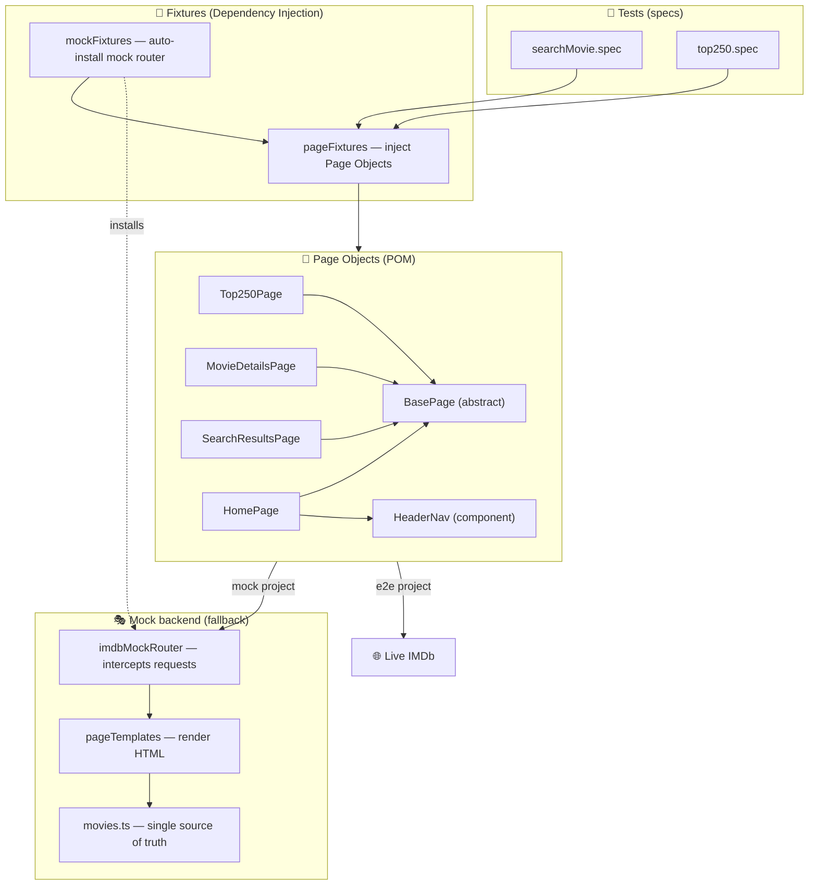
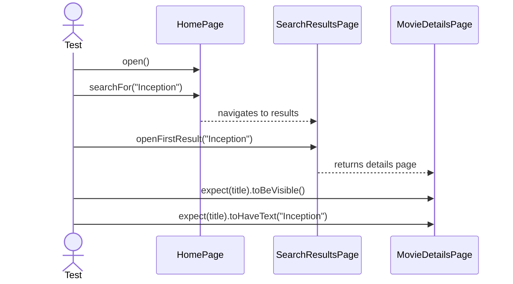
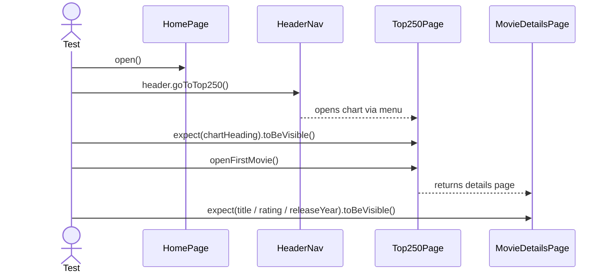
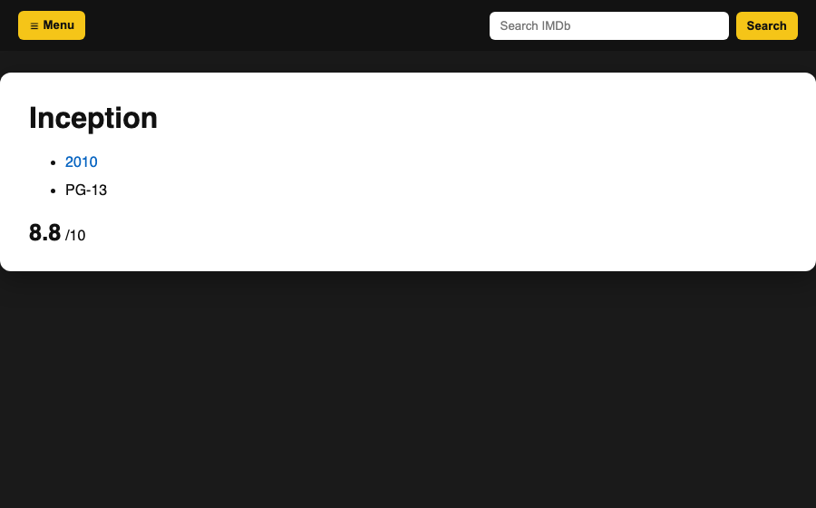
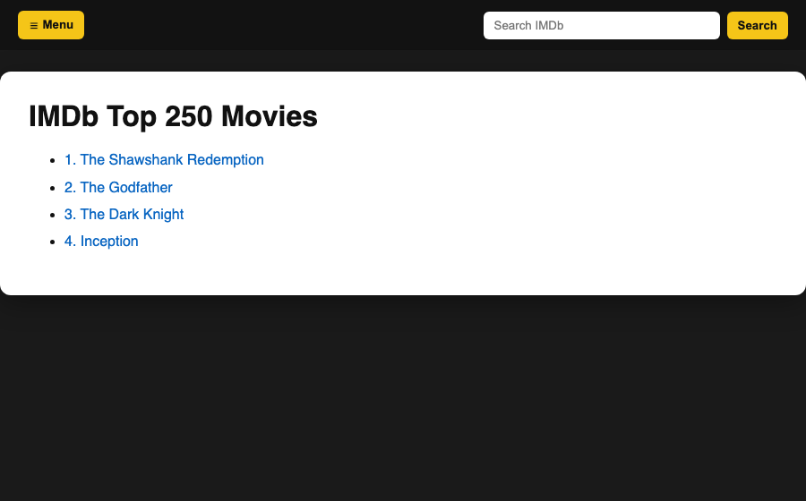
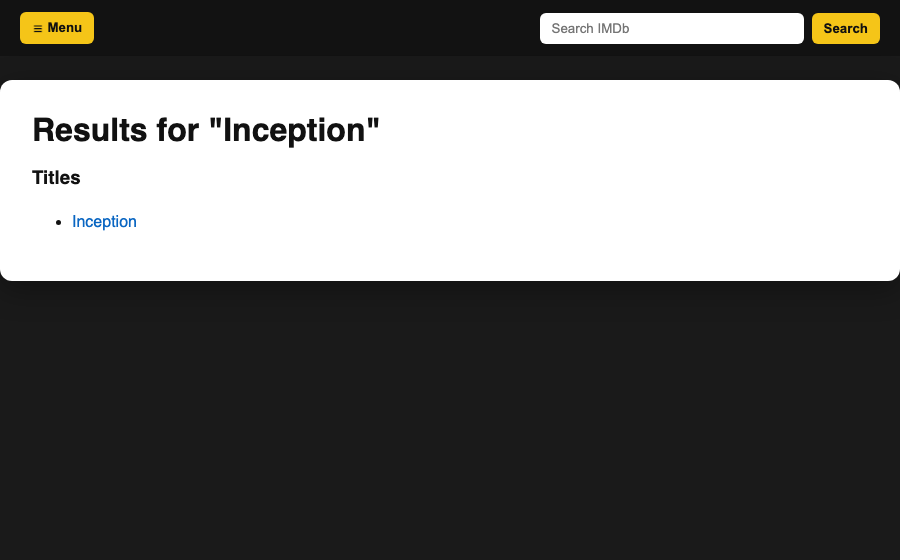

<div align="center">

# 🎬 Cívica — IMDb Test Automation Challenge

**A small, production-shaped test automation framework built with [Playwright](https://playwright.dev/) + [TypeScript](https://www.typescriptlang.org/), organized around the Page Object Model, with a deterministic mock layer as a fallback for the two required IMDb user flows.**

[](https://github.com/criguex/civica-playwright-challenge/actions/workflows/ci.yml)
[](https://playwright.dev/)
[](https://www.typescriptlang.org/)
[](https://nodejs.org/)
[](LICENSE)

</div>

---

## 📑 Table of contents

- [Overview](#-overview)
- [Requirements traceability](#-requirements-traceability)
- [Highlights](#-highlights)
- [Architecture](#-architecture)
- [Project structure](#-project-structure)
- [Design principles](#-design-principles)
- [Locator strategy — no XPath/CSS](#-locator-strategy--no-xpathcss)
- [Test scenarios](#-test-scenarios)
- [Why a mock layer?](#-why-a-mock-layer)
- [Getting started](#-getting-started)
- [Available scripts](#-available-scripts)
- [Configuration](#-configuration)
- [Reports & artifacts](#-reports--artifacts)
- [Continuous integration](#-continuous-integration)
- [Scaling this framework](#-scaling-this-framework)
- [Tech stack](#-tech-stack)
- [Author](#-author)

---

## 🎯 Overview

This repository implements the technical challenge: **build a small test-automation framework with Playwright + TypeScript, apply the Page Object Model, avoid XPath/CSS locators (use `getByRole`, `getByTestId`, … instead), and automate two common IMDb user flows.**

IMDb actively blocks automation behind a _"Let's confirm you are human"_ security wall (see [Why a mock layer?](#-why-a-mock-layer)). Because a good framework must stay **green and demonstrable regardless of a third party's availability**, the suite runs in two modes that share the **exact same Page Objects**:

| Project    | Backend                                        | Reliability                                | When                 |
| ---------- | ---------------------------------------------- | ------------------------------------------ | -------------------- |
| **`mock`** | In-process IMDb replica (request interception) | ✅ Deterministic, offline, always green    | Default · CI · demos |
| **`e2e`**  | Live `imdb.com`                                | ⚠️ Best-effort (subject to bot-protection) | Opt-in exploration   |

> The mock is not a shortcut — it is the fallback the challenge explicitly asks for, wired so that **one set of Page Objects proves the design against both a controlled replica and the real site.**

---

## ✅ Requirements traceability

| #   | Requirement                                        | Where it lives                                                                                                                                          |
| --- | -------------------------------------------------- | ------------------------------------------------------------------------------------------------------------------------------------------------------- |
| 1   | Playwright + TypeScript                            | [`package.json`](package.json), [`tsconfig.json`](tsconfig.json)                                                                                        |
| 2   | Page Object Model                                  | [`src/pages/`](src/pages)                                                                                                                               |
| 3   | Config: browser / reporter / base URL              | [`playwright.config.ts`](playwright.config.ts)                                                                                                          |
| 4   | No XPath/CSS — use `getByRole` / `getByTestId` / … | every Page Object (see [strategy](#-locator-strategy--no-xpathcss))                                                                                     |
| 5   | **TC1** — Search & validate movie                  | [`tests/mock/searchMovie.mock.spec.ts`](tests/mock/searchMovie.mock.spec.ts) · [`tests/e2e/searchMovie.e2e.spec.ts`](tests/e2e/searchMovie.e2e.spec.ts) |
| 6   | **TC2** — Navigate Top 250 (via menu)              | [`tests/mock/top250.mock.spec.ts`](tests/mock/top250.mock.spec.ts) · [`tests/e2e/top250.e2e.spec.ts`](tests/e2e/top250.e2e.spec.ts)                     |
| 7   | Mocks when nothing is operational                  | [`mocks/`](mocks)                                                                                                                                       |
| 8   | Best practices / camelCase / SOLID / scalable      | [design principles](#-design-principles)                                                                                                                |

---

## ✨ Highlights

- **One Page Object suite, two backends** — the same abstractions drive the mock and the live site.
- **Semantic, user-facing locators only** — `getByRole`, `getByTestId`, `getByPlaceholder`. Zero XPath, zero CSS selectors.
- **Dependency-injected Page Objects** via Playwright fixtures — specs read like plain English.
- **Deterministic mock server** — a request router renders IMDb-shaped HTML from a single data source, so tests never flake and run offline.
- **CI-ready** — GitHub Actions runs typecheck + the mock suite and uploads the HTML report on every push/PR.
- **Rich diagnostics** — traces on first retry, screenshots + video on failure, HTML + JUnit reports.

---

## 🏗️ Architecture



**Layered flow:** a spec asks a fixture for a Page Object → the Page Object speaks to the browser through semantic locators → in the `mock` project those requests are transparently answered by the in-process router; in the `e2e` project they hit the real site. Nothing about the Page Objects changes between the two.

---

## 📁 Project structure

```text
civica-playwright-challenge/
├── src/
│   ├── config/
│   │   └── testConfig.ts          # Typed env access (base URL) — single responsibility
│   ├── fixtures/
│   │   └── pageFixtures.ts        # Page Objects as injectable fixtures (DI)
│   ├── pages/
│   │   ├── basePage.ts            # Abstract parent: shared navigation primitives
│   │   ├── homePage.ts            # Home + global search
│   │   ├── searchResultsPage.ts   # Find/results page
│   │   ├── movieDetailsPage.ts    # Title, rating, year locators/readers
│   │   ├── top250Page.ts          # Top 250 chart
│   │   └── components/
│   │       └── headerNav.ts       # Reusable menu component (composition)
│   └── utils/
│       └── logger.ts              # Single logging seam
├── tests/
│   ├── mock/                      # Deterministic suite (default)
│   │   ├── mockFixtures.ts        # Extends fixtures with the mock router (auto)
│   │   ├── searchMovie.mock.spec.ts
│   │   └── top250.mock.spec.ts
│   └── e2e/                       # Live-site suite (opt-in)
│       ├── searchMovie.e2e.spec.ts
│       └── top250.e2e.spec.ts
├── mocks/
│   ├── data/
│   │   └── movies.ts              # Catalogue — single source of truth
│   └── server/
│       ├── imdbMockRouter.ts      # Request interception → HTML
│       └── pageTemplates.ts       # IMDb-shaped HTML rendered from data
├── docs/img/                      # Diagrams & screenshots used in this README
├── .github/workflows/ci.yml       # CI pipeline
├── playwright.config.ts           # Browser / reporters / base URL / projects
├── tsconfig.json                  # Strict TypeScript
└── package.json
```

---

## 🧱 Design principles

### Page Object Model

Every page is a class that hides _how_ to interact with the UI behind intention-revealing methods (`searchFor`, `openFirstResult`, `openFirstMovie`). Tests describe **what** the user does; Page Objects own **how**.

### SOLID, applied pragmatically

| Principle                 | How it shows up here                                                                                                                                                               |
| ------------------------- | ---------------------------------------------------------------------------------------------------------------------------------------------------------------------------------- |
| **S**ingle responsibility | `testConfig` owns env access; `logger` owns logging; each page owns one screen; the router owns interception; templates own HTML.                                                  |
| **O**pen/closed           | `BasePage` centralizes shared behaviour; pages _extend_ it without modifying it. New pages plug in without touching existing ones.                                                 |
| **L**iskov substitution   | Every Page Object is a drop-in `BasePage`; fixtures treat them uniformly.                                                                                                          |
| **I**nterface segregation | `MovieDetailsPage` exposes only the three facts under test (title/rating/year) — callers depend on nothing more.                                                                   |
| **D**ependency inversion  | Tests depend on injected abstractions (fixtures), not on `new SomePage(page)` construction details. The mock vs. live backend is swapped without touching a single test assertion. |

### Composition over inheritance

The site menu is a **component** (`HeaderNav`) that pages _compose_, rather than a base-class behaviour every page would inherit whether it needs it or not.

### Other conventions

- **camelCase** for files, variables and methods; **PascalCase** for classes/types.
- **Strict TypeScript** (`noUnusedLocals`, `noImplicitAny`, …) — the build fails on dead code.
- **DRY mock data** — expected values in tests are imported from the same module the mock renders from, so they can never drift.
- **Prettier** enforces a single formatting style.

---

## 🎯 Locator strategy — no XPath/CSS

Per the challenge, **no XPath and no CSS selectors** are used anywhere. Elements are addressed the way a user (or assistive tech) perceives them:

| Element               | Locator used                                              | Why                              |
| --------------------- | --------------------------------------------------------- | -------------------------------- |
| Search box            | `getByPlaceholder('Search IMDb')`                         | User-facing text                 |
| Menu button           | `getByRole('button', { name: /open navigation menu/i })`  | Accessible role + name           |
| "Top 250 Movies" link | `getByRole('link', { name: /top 250 movies/i })`          | Accessible role + name           |
| Movie title           | `getByTestId('hero__pageTitle')`                          | Stable IMDb test id              |
| Rating                | `getByTestId('hero-rating-bar__aggregate-rating__score')` | Stable IMDb test id              |
| Release year          | `getByRole('link', { name: /^(19\|20)\d{2}$/ })`          | Accessible role + semantic shape |
| First chart movie     | `getByRole('link', { name: /^1\.\s/ })`                   | Ranked, accessible name          |

> These are **resilient** (survive styling/DOM refactors) and **meaningful** (a failing test points at a user-visible thing), which is exactly why Playwright recommends them over XPath/CSS.

---

## 🧪 Test scenarios

### TC1 · Search and validate movie



### TC2 · Navigate Top 250 movies (via menu)



Both flows are implemented **twice with identical logic** — once in `tests/mock` (deterministic) and once in `tests/e2e` (live) — proving the Page Objects are backend-agnostic.

---

## 🎭 Why a mock layer?

Running the `e2e` suite against the real site returns IMDb's anti-bot interstitial instead of the app:

<div align="center">
  
  <p><em>Live IMDb greets automation with a human-verification wall — outside our control.</em></p>
</div>

A framework whose green/red status depends on a third party's bot defenses is not trustworthy. So the `mock` project intercepts every request (`page.route`) and answers document requests with **IMDb-shaped HTML rendered from a single data source** — same roles, same `data-testid`s, same ranked-link labels the Page Objects query. The result is a fast, offline, 100%-deterministic replica that the very same tests drive:

<div align="center">
  
  
  
  <p><em>The in-process mock: movie details · Top 250 chart · search results.</em></p>
</div>

---

## 🚀 Getting started

### Prerequisites

- **Node.js ≥ 18** (developed on Node 20+/26)
- npm

### Install

```bash
git clone https://github.com/criguex/civica-playwright-challenge.git
cd civica-playwright-challenge
npm install          # also installs the Chromium browser (postinstall)
```

### Run the default (mock) suite

```bash
npm test             # runs the deterministic mock suite headless
```

Expected output:

```text
Running 2 tests using 2 workers
  ✓  TC1 · Search and validate movie @mock @smoke
  ✓  TC2 · Navigate Top 250 movies @mock
  2 passed
```

### Run against the live site (opt-in)

```bash
npm run test:e2e     # may hit IMDb's bot wall — see above
```

---

## 🧰 Available scripts

| Script                            | Description                                    |
| --------------------------------- | ---------------------------------------------- |
| `npm test`                        | Run the **mock** suite (default, always green) |
| `npm run test:mock`               | Same as above, explicit                        |
| `npm run test:e2e`                | Run the **live IMDb** suite (opt-in)           |
| `npm run test:all`                | Run both projects                              |
| `npm run test:headed`             | Mock suite with a visible browser              |
| `npm run test:ui`                 | Playwright's interactive UI mode               |
| `npm run test:debug`              | Step-through debugging (`PWDEBUG`)             |
| `npm run report`                  | Open the last HTML report                      |
| `npm run typecheck`               | `tsc --noEmit` — strict type checking          |
| `npm run format` / `format:check` | Prettier write / verify                        |
| `npm run codegen`                 | Launch Playwright codegen against IMDb         |

---

## ⚙️ Configuration

All configuration lives in [`playwright.config.ts`](playwright.config.ts):

- **Browser** — Chromium (`Desktop Chrome` device) per project; easily extended to Firefox/WebKit.
- **Reporters** — `list` (console) + `html` + `junit` (CI-friendly).
- **Base URL** — `https://www.imdb.com`, overridable via `BASE_URL` (see [`.env.example`](.env.example)). The mock router intercepts this origin, so relative `goto('/')` calls work in both modes.
- **Diagnostics** — `trace: on-first-retry`, `screenshot: only-on-failure`, `video: retain-on-failure`.
- **Locale** — forced `en-US` so IMDb copy and test ids stay deterministic.

---

## 📊 Reports & artifacts

- **HTML report** → `playwright-report/` (open with `npm run report`).
- **JUnit XML** → `test-results/junit.xml` (for CI dashboards).
- **On failure** → screenshot, video and a trace are attached automatically. Open a trace with:
  ```bash
  npx playwright show-trace test-results/<...>/trace.zip
  ```

---

## 🤖 Continuous integration

[`.github/workflows/ci.yml`](.github/workflows/ci.yml) runs on every push and pull request to `main`:


CI runs the **mock** suite so the pipeline is fast and never fails on IMDb's bot defenses.

---

## 📈 Scaling this framework

This layout is intentionally ready to grow:

- **New page?** Add a class under `src/pages/` extending `BasePage`, expose it as a fixture — every spec can use it immediately.
- **New flow?** Add a `*.spec.ts`; reuse existing Page Objects and fixtures.
- **New browser?** Add a project entry in `playwright.config.ts` (`Firefox`, `WebKit`, mobile emulation).
- **More mock data?** Add records to `mocks/data/movies.ts`; templates and tests pick them up automatically.
- **Visual / API / accessibility testing?** Drop in Playwright's `toHaveScreenshot`, `request` fixture, or an a11y plugin without restructuring.
- **Sharding at scale?** Playwright's `--shard` flag parallelizes across CI runners with no code changes.

---

## 🛠️ Tech stack

| Tool                                                  | Role                                                 |
| ----------------------------------------------------- | ---------------------------------------------------- |
| [Playwright Test](https://playwright.dev/)            | Test runner, browser automation, fixtures, reporters |
| [TypeScript](https://www.typescriptlang.org/)         | Strict typing across framework and tests             |
| [Prettier](https://prettier.io/)                      | Consistent formatting                                |
| [GitHub Actions](https://github.com/features/actions) | CI                                                   |

---

## 👤 Author

**Cristian Guerra** — QA Automation Engineer
[GitHub @criguex](https://github.com/criguex)

Built as a technical challenge submission. Licensed under [MIT](LICENSE).
