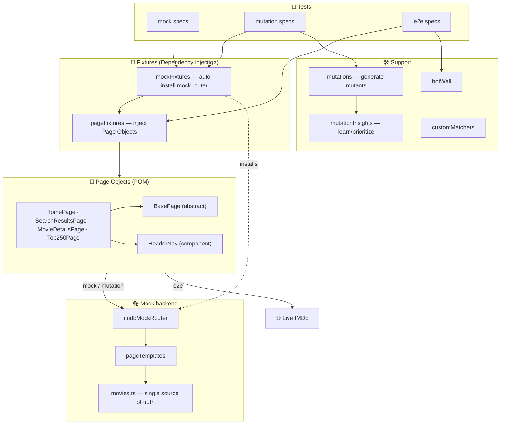
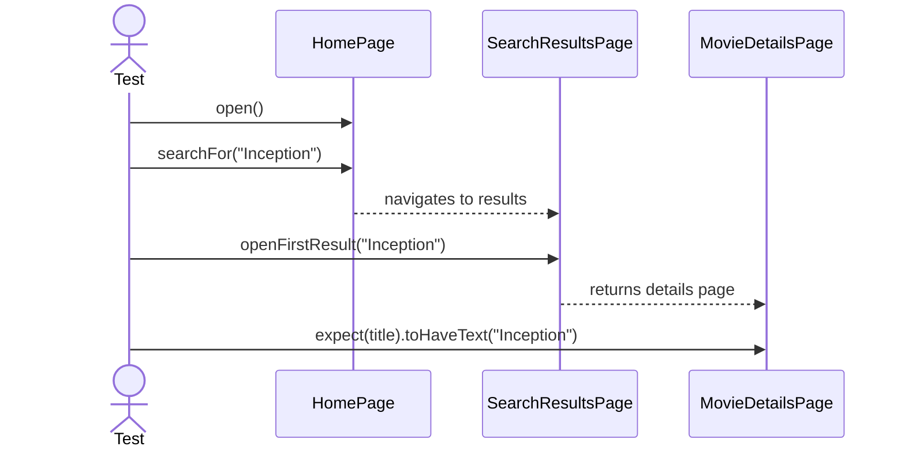
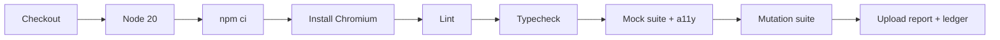

<p align="right"><strong>English</strong> · <a href="README.es.md">Español</a></p>

<div align="center">

# 🎬 Cívica — IMDb Test Automation Challenge

**A production-shaped test automation framework built with [Playwright](https://playwright.dev/) + [TypeScript](https://www.typescriptlang.org/), organized around the Page Object Model — with a deterministic mock layer, accessibility checks, and a self-learning mutant-scenario engine.**

[](https://github.com/criguex/civica-playwright-challenge/actions/workflows/ci.yml)
[](https://playwright.dev/)
[](https://www.typescriptlang.org/)
[](https://nodejs.org/)
[](LICENSE)

</div>

---

## 📑 Table of contents

- [Overview](#-overview)
- [Requirements traceability](#-requirements-traceability)
- [Highlights](#-highlights)
- [Architecture](#-architecture)
- [Project structure](#-project-structure)
- [Design principles](#-design-principles)
- [Locator strategy — no XPath/CSS](#-locator-strategy--no-xpathcss)
- [Test scenarios](#-test-scenarios)
- [Mutant scenarios — coverage that learns](#-mutant-scenarios--coverage-that-learns)
- [Accessibility](#-accessibility)
- [Why a mock layer?](#-why-a-mock-layer)
- [Getting started](#-getting-started)
- [Available scripts](#-available-scripts)
- [Configuration](#-configuration)
- [Reports & artifacts](#-reports--artifacts)
- [Continuous integration](#-continuous-integration)
- [Grow & migrate](#-grow--migrate)
- [Tech stack](#-tech-stack)
- [Author](#-author)

---

## 🎯 Overview

This repository implements the technical challenge: **build a test-automation
framework with Playwright + TypeScript, apply the Page Object Model, avoid
XPath/CSS locators, and automate two common IMDb user flows** — then takes it
further with data-driven coverage, accessibility checks and a learning mutation
engine.

IMDb actively blocks automation behind a _"Let's confirm you are human"_ wall
(see [Why a mock layer?](#-why-a-mock-layer)). Because a good framework must stay
**green and demonstrable regardless of a third party's availability**, the suite
runs in projects that share the **exact same Page Objects**:

| Project        | Backend                                        | Reliability                                         | When                 |
| -------------- | ---------------------------------------------- | --------------------------------------------------- | -------------------- |
| **`mock`**     | In-process IMDb replica (request interception) | ✅ Deterministic, offline, always green             | Default · CI · demos |
| **`mutation`** | Mock + generated mutant scenarios              | ✅ Deterministic, self-learning                     | Coverage expansion   |
| **`e2e`**      | Live `imdb.com`                                | ⚠️ Best-effort — skips honestly behind the bot wall | Opt-in exploration   |

> **42 tests — 40 passing, 2 honestly skipped** (live E2E behind the anti-bot wall).

---

## ✅ Requirements traceability

| #   | Requirement                                        | Where it lives                                                                                                                                          |
| --- | -------------------------------------------------- | ------------------------------------------------------------------------------------------------------------------------------------------------------- |
| 1   | Playwright + TypeScript                            | [`package.json`](package.json), [`tsconfig.json`](tsconfig.json)                                                                                        |
| 2   | Page Object Model                                  | [`src/pages/`](src/pages)                                                                                                                               |
| 3   | Config: browser / reporter / base URL              | [`playwright.config.ts`](playwright.config.ts)                                                                                                          |
| 4   | No XPath/CSS — use `getByRole` / `getByTestId` / … | every Page Object (see [strategy](#-locator-strategy--no-xpathcss))                                                                                     |
| 5   | **TC1** — Search & validate movie                  | [`tests/mock/searchMovie.mock.spec.ts`](tests/mock/searchMovie.mock.spec.ts) · [`tests/e2e/searchMovie.e2e.spec.ts`](tests/e2e/searchMovie.e2e.spec.ts) |
| 6   | **TC2** — Navigate Top 250 (via menu)              | [`tests/mock/top250.mock.spec.ts`](tests/mock/top250.mock.spec.ts) · [`tests/e2e/top250.e2e.spec.ts`](tests/e2e/top250.e2e.spec.ts)                     |
| 7   | Mocks when nothing is operational                  | [`mocks/`](mocks)                                                                                                                                       |
| 8   | Best practices / camelCase / SOLID / scalable      | [design principles](#-design-principles)                                                                                                                |
| ➕  | Data-driven + negative tests, deep validations     | [`tests/mock/`](tests/mock)                                                                                                                             |
| ➕  | Accessibility (axe-core)                           | [`tests/mock/accessibility.mock.spec.ts`](tests/mock/accessibility.mock.spec.ts)                                                                        |
| ➕  | Learning mutant scenarios                          | [`docs/MUTATION-TESTING.md`](docs/MUTATION-TESTING.md)                                                                                                  |

---

## ✨ Highlights

- **One Page Object suite, three backends** — the same abstractions drive the mock, the mutation engine and the live site.
- **Semantic locators only** — `getByRole`, `getByTestId`, `getByPlaceholder`. Zero XPath, zero CSS.
- **Dependency-injected Page Objects** via Playwright fixtures — specs read like plain English.
- **Deterministic mock server** — a router renders IMDb-shaped HTML from a single data source; tests never flake and run offline.
- **🧬 Learning mutant scenarios** — golden flows are mutated into many self-checking scenarios, prioritized from previous-run insights.
- **♿ Accessibility checks** — axe-core gates serious/critical violations on every mock page.
- **Custom matchers** — `toBeValidRating`, `toBeValidReleaseYear` for expressive, domain-level assertions.
- **Honest E2E** — live tests `skip` with a clear reason behind the bot wall instead of failing.
- **CI-ready** — GitHub Actions runs lint + typecheck + mock + mutation suites and uploads reports.

---

## 🏗️ Architecture



---

## 📁 Project structure

```text
civica-playwright-challenge/
├── src/
│   ├── config/testConfig.ts        # Typed, multi-environment config (TEST_ENV)
│   ├── fixtures/
│   │   ├── pageFixtures.ts          # Page Objects as injectable fixtures (DI)
│   │   └── mockFixtures.ts          # Adds the auto-installed mock router
│   ├── pages/
│   │   ├── basePage.ts              # Abstract parent: shared navigation
│   │   ├── homePage.ts              # Home + global search
│   │   ├── searchResultsPage.ts     # Find/results page
│   │   ├── movieDetailsPage.ts      # Title, rating, year, genres, runtime
│   │   ├── top250Page.ts            # Top 250 chart + ranking integrity
│   │   └── components/headerNav.ts  # Reusable menu component (composition)
│   ├── support/
│   │   ├── customMatchers.ts        # toBeValidRating / toBeValidReleaseYear
│   │   ├── botWall.ts               # Honest anti-bot detection for e2e
│   │   ├── mutations.ts             # 🧬 Mutant-scenario generator
│   │   ├── mutationInsights.ts      # Learning loop (load + prioritize)
│   │   └── mutationPaths.ts         # Ledger location
│   └── utils/logger.ts              # Single logging seam
├── tests/
│   ├── mock/                        # Deterministic suite (default) + a11y
│   │   ├── searchMovie.mock.spec.ts
│   │   ├── top250.mock.spec.ts
│   │   ├── movieDetails.mock.spec.ts
│   │   └── accessibility.mock.spec.ts
│   ├── mutation/                    # 🧬 Learning mutant scenarios
│   │   └── searchMutants.mutation.spec.ts
│   └── e2e/                         # Live-site suite (opt-in)
│       ├── searchMovie.e2e.spec.ts
│       └── top250.e2e.spec.ts
├── mocks/
│   ├── data/movies.ts               # Catalogue — single source of truth
│   └── server/
│       ├── imdbMockRouter.ts        # Request interception → HTML
│       └── pageTemplates.ts         # IMDb-shaped HTML rendered from data
├── reporters/mutationInsightsReporter.ts   # Writes the learning ledger
├── docs/                            # Guides, ADRs, diagrams, screenshots
│   ├── GROWTH.md · MIGRATION.md · MUTATION-TESTING.md
│   └── adr/0001…0005-*.md
├── .github/workflows/ci.yml         # CI pipeline
├── Dockerfile                       # CI-parity execution
├── eslint.config.js · playwright.config.ts · tsconfig.json
└── package.json
```

---

## 🧱 Design principles

### Page Object Model

Every page is a class hiding _how_ to interact with the UI behind
intention-revealing methods (`searchFor`, `openFirstResult`, `openMovieAtRank`).

### SOLID, applied pragmatically

| Principle                 | How it shows up here                                                                                                                                               |
| ------------------------- | ------------------------------------------------------------------------------------------------------------------------------------------------------------------ |
| **S**ingle responsibility | `testConfig` owns env; `logger` owns logging; each page owns one screen; the router owns interception; `mutations` owns generation; the reporter owns persistence. |
| **O**pen/closed           | `BasePage` centralizes shared behaviour; pages _extend_ it. New mutators/pages plug in without editing existing code.                                              |
| **L**iskov substitution   | Every Page Object is a drop-in `BasePage`; fixtures treat them uniformly.                                                                                          |
| **I**nterface segregation | `MovieDetailsPage` exposes only the facts under test; callers depend on nothing more.                                                                              |
| **D**ependency inversion  | Tests depend on injected fixtures, not on construction. Mock vs. live is swapped without touching an assertion.                                                    |

### Other conventions

- **camelCase** files/variables/methods; **PascalCase** classes/types.
- **Strict TypeScript** + **ESLint** (0-warning policy) + **Prettier**.
- **DRY data** — expected values are imported from the same module the mock renders from.
- **Composition over inheritance** — the menu is a component pages compose.
- Notable decisions captured as [ADRs](docs/adr).

---

## 🎯 Locator strategy — no XPath/CSS

| Element               | Locator                                                   | Why                              |
| --------------------- | --------------------------------------------------------- | -------------------------------- |
| Search box            | `getByPlaceholder('Search IMDb')`                         | User-facing text                 |
| Menu button           | `getByRole('button', { name: /open navigation menu/i })`  | Accessible role + name           |
| "Top 250 Movies" link | `getByRole('link', { name: /top 250 movies/i })`          | Accessible role + name           |
| Movie title           | `getByTestId('hero__pageTitle')`                          | Stable IMDb test id              |
| Rating                | `getByTestId('hero-rating-bar__aggregate-rating__score')` | Stable IMDb test id              |
| Release year          | `getByRole('link', { name: /^(19\|20)\d{2}$/ })`          | Accessible role + semantic shape |
| Ranked chart movie    | `getByRole('link', { name: /^\d+\.\s/ })`                 | Ranked, accessible name          |

> Resilient (survive DOM/styling refactors) and meaningful (failures point at a
> user-visible thing) — exactly why Playwright recommends them over XPath/CSS.

---

## 🧪 Test scenarios

### TC1 · Search and validate movie



Extended with **data-driven** coverage across the whole catalogue, a
**case-insensitive** variant, a **negative** "no results" path, and **deep
validations** (rating in range, plausible year, genres, runtime, canonical URL).

### TC2 · Navigate Top 250 movies (via menu)


Plus a **ranking-integrity** test: the chart is populated and correctly ordered.

---

## 🧬 Mutant scenarios — coverage that learns

The framework's forward-looking layer: instead of hand-writing every edge case,
**golden flows are mutated** into many self-checking scenarios, and **previous
runs teach the next one** which mutants matter most.


| Class        | Intent                      | Example (`Inception`)        | Expected    |
| ------------ | --------------------------- | ---------------------------- | ----------- |
| `equivalent` | Must not change behaviour   | `INCEPTION`, `  Inception  ` | still found |
| `boundary`   | Edge that should still work | `Incep` (partial)            | still found |
| `negative`   | Behaviour must change       | `zzqxw404movie`              | no results  |

```bash
npm run test:mutation
cat test-results/mutation-insights.json   # what it learned
```

📖 Full rationale, learning loop and roadmap: **[docs/MUTATION-TESTING.md](docs/MUTATION-TESTING.md)**.

---

## ♿ Accessibility

Every mock page is scanned with **axe-core** ([`accessibility.mock.spec.ts`](tests/mock/accessibility.mock.spec.ts)),
gating on `serious`/`critical` WCAG 2 A/AA violations — a pragmatic, non-flaky
bar. Because the mock is deterministic, a11y checks are stable and offline.

```bash
npm run test:a11y
```

---

## 🎭 Why a mock layer?

Running the `e2e` suite against the real site returns IMDb's anti-bot
interstitial instead of the app:

<div align="center">
  
  <p><em>Live IMDb greets automation with a human-verification wall — outside our control.</em></p>
</div>

So the `mock` project intercepts every request (`page.route`) and answers with
**IMDb-shaped HTML rendered from a single data source** — same roles, same
`data-testid`s the Page Objects query. The result is a fast, offline,
100%-deterministic replica that the very same tests drive:

<div align="center">
  
  
  
  <p><em>The in-process mock: movie details · Top 250 chart · search results.</em></p>
</div>

And when the live site _is_ reachable, E2E runs the identical flow; when it is
not, it **skips honestly** with a documented reason — never a false red.

---

## 🚀 Getting started

### Prerequisites

- **Node.js ≥ 18** · npm

### Install & run

```bash
git clone https://github.com/criguex/civica-playwright-challenge.git
cd civica-playwright-challenge
npm install          # also installs Chromium (postinstall)

npm test             # deterministic mock suite (always green)
npm run test:mutation# learning mutant scenarios
npm run test:e2e     # live IMDb (opt-in; skips behind the bot wall)
```

Expected default output:

```text
Running 19 tests using N workers
  ✓  TC1 · Search and validate movie …
  ✓  TC2 · Navigate Top 250 movies …
  ✓  Movie details · deep validations …
  ✓  Accessibility …
  19 passed
```

---

## 🧰 Available scripts

| Script                                           | Description                            |
| ------------------------------------------------ | -------------------------------------- |
| `npm test`                                       | **mock** suite (default, always green) |
| `npm run test:mock`                              | Same, explicit                         |
| `npm run test:mutation`                          | 🧬 Learning mutant scenarios           |
| `npm run test:a11y`                              | Accessibility checks only (`@a11y`)    |
| `npm run test:e2e`                               | Live IMDb suite (opt-in)               |
| `npm run test:all`                               | All projects                           |
| `npm run test:headed` / `test:ui` / `test:debug` | Visible / interactive / step-through   |
| `npm run report`                                 | Open the last HTML report              |
| `npm run lint` / `lint:fix`                      | ESLint                                 |
| `npm run typecheck`                              | `tsc --noEmit`                         |
| `npm run format` / `format:check`                | Prettier                               |
| `npm run codegen`                                | Playwright codegen against IMDb        |

---

## ⚙️ Configuration

All in [`playwright.config.ts`](playwright.config.ts) + [`src/config/testConfig.ts`](src/config/testConfig.ts):

- **Browser** — Chromium (`Desktop Chrome`) per project; extend to Firefox/WebKit trivially.
- **Reporters** — `list` + `html` + `junit` + the mutation-insights ledger.
- **Environments** — `TEST_ENV=prod|staging|dev` selects a base URL; `BASE_URL` overrides. The mock router intercepts the chosen origin.
- **Diagnostics** — trace on first retry, screenshot + video on failure.
- **Locale** — forced `en-US` for deterministic copy/test-ids.

---

## 📊 Reports & artifacts

- **HTML report** → `playwright-report/` (`npm run report`).
- **JUnit XML** → `test-results/junit.xml` (CI dashboards).
- **Mutation ledger** → `test-results/mutation-insights.json` (learning input).
- **On failure** → screenshot, video and trace attached automatically.

---

## 🤖 Continuous integration

[`.github/workflows/ci.yml`](.github/workflows/ci.yml) runs on every push/PR to `main`:



CI runs the deterministic projects, so the pipeline is fast and never fails on
IMDb's bot defenses.

---

## 📈 Grow & migrate

- **[docs/GROWTH.md](docs/GROWTH.md)** — add pages, browsers, environments, Allure, visual regression, sharding, husky, API tests.
- **[docs/MIGRATION.md](docs/MIGRATION.md)** — retarget to another site/app, run in Docker, cloud grids (BrowserStack/Sauce), other CIs (GitLab/Azure/Jenkins), upgrade Playwright.
- **[docs/MUTATION-TESTING.md](docs/MUTATION-TESTING.md)** — extend the learning coverage engine.
- **[docs/adr/](docs/adr)** — the decisions behind the design.

### 🧠 Semantic oracle (Jev)

Assert *meaning* instead of strings, and triage every failure before a human
reads it. Runs against a labelled offline stub when no API key is present, so a
fresh clone stays green.

```bash
npm run test:jev
```

- **[docs/jev-pipeline.html](docs/jev-pipeline.html)** — interactive walkthrough: follow a feature through the pipeline, including the loop it takes when something fails.
- **[docs/jev-explicado.es.md](docs/jev-explicado.es.md)** — explained from zero, in Spanish.
- **[docs/adr/0006-jev-semantic-oracle.md](docs/adr/0006-jev-semantic-oracle.md)** — the decision, and its trade-offs.

---

## 🛠️ Tech stack

| Tool                                                             | Role                                            |
| ---------------------------------------------------------------- | ----------------------------------------------- |
| [Playwright Test](https://playwright.dev/)                       | Runner, browser automation, fixtures, reporters |
| [TypeScript](https://www.typescriptlang.org/)                    | Strict typing                                   |
| [axe-core](https://github.com/dequelabs/axe-core)                | Accessibility engine                            |
| [ESLint](https://eslint.org/) + [Prettier](https://prettier.io/) | Linting + formatting                            |
| [GitHub Actions](https://github.com/features/actions)            | CI                                              |

---

## 👤 Author

**Cristian Guerra** — QA Automation Engineer · [GitHub @criguex](https://github.com/criguex)

Built as a technical challenge submission. Licensed under [MIT](LICENSE).
