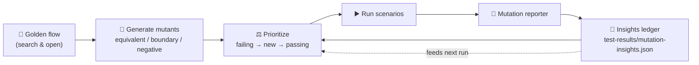

# 🧬 Mutant scenarios — coverage that learns

> The "future" layer of this framework: instead of hand-writing every edge case,
> we **mutate golden flows** into many scenarios and let **previous runs teach
> the next one** which mutants matter most.

This is the automation-testing analogue of the _flow-mutation_ strategy: take a
known-good ("golden") user journey and systematically perturb it to discover
where the application's behaviour changes when it shouldn't (or fails to change
when it should).

---

## Why

A single happy-path test proves the flow works **once, one way**. Real users
type `INCEPTION`, `inception`, partial titles, and gibberish. Writing each of
those by hand is tedious and always incomplete. A mutation engine:

- **widens coverage automatically** — one golden flow → N self-checking scenarios;
- **stays honest** — each mutant declares its expected outcome class, so it is a
  real assertion, not just a smoke run;
- **gets smarter over time** — outcomes feed a ledger that prioritizes the next run.

---

## The three mutant classes

| Class        | Intent                               | Example (seed `Inception`)                | Expected    |
| ------------ | ------------------------------------ | ----------------------------------------- | ----------- |
| `equivalent` | Behaviour must **not** change        | `INCEPTION`, `inception`, `  Inception  ` | still found |
| `boundary`   | Probe an edge that should still work | `Incep` (partial prefix)                  | still found |
| `negative`   | Behaviour **must** change            | `Inception qzx404`, `zzqxw404movie`       | no results  |

Mutators live in [`src/support/mutations.ts`](../src/support/mutations.ts) and are
generated per seed title by `generateSearchMutants(title)`. Adding a mutator
instantly multiplies coverage across every seed.

---

## The learning loop



1. **Generate** — `generateSearchMutants()` expands each seed into the full set.
2. **Prioritize** — `prioritize()` reads the ledger and re-orders so that
   _previously-failing_ mutants run first, then _never-seen_ ones (new coverage),
   then _consistently-passing_ ones. Sorting is stable → the run stays deterministic.
3. **Run** — scenarios execute against the deterministic mock.
4. **Record** — the [`mutationInsightsReporter`](../reporters/mutationInsightsReporter.ts)
   writes each `@mutant` outcome (cumulative `runs`/`failures`) back to the ledger.
5. **Repeat** — the next run learns from this one.

The ledger is a build artifact (git-ignored). On a fresh clone it is empty and
mutants run in declared order; after the first run it exists locally/as a CI
artifact and steers subsequent prioritization.

---

## Run it

```bash
npm run test:mutation        # generate → prioritize → run → record
cat test-results/mutation-insights.json   # inspect what it learned
```

---

## Roadmap

This engine is deliberately small but designed to grow:

- **More golden flows** — mutate the Top 250 journey (rank boundaries, deep
  pagination), not just search.
- **Richer mutators** — accents/diacritics, emoji, RTL text, very long inputs,
  injection-style payloads (as negative/robustness mutants).
- **Smarter learning** — weight by _recency_ and _flakiness rate_, auto-quarantine
  chronically-flaky mutants, and surface a "most valuable mutants" report.
- **Failure-driven generation** — when a mutant catches a real bug, auto-derive
  neighbouring mutants around it (the failure becomes a new seed).
- **Metamorphic relations** — assert invariants across mutants (e.g. results for
  `X` ⊇ results for a prefix of `X`).

See also: [GROWTH.md](GROWTH.md) · [ADR-0005](adr/0005-mutant-scenarios.md).
